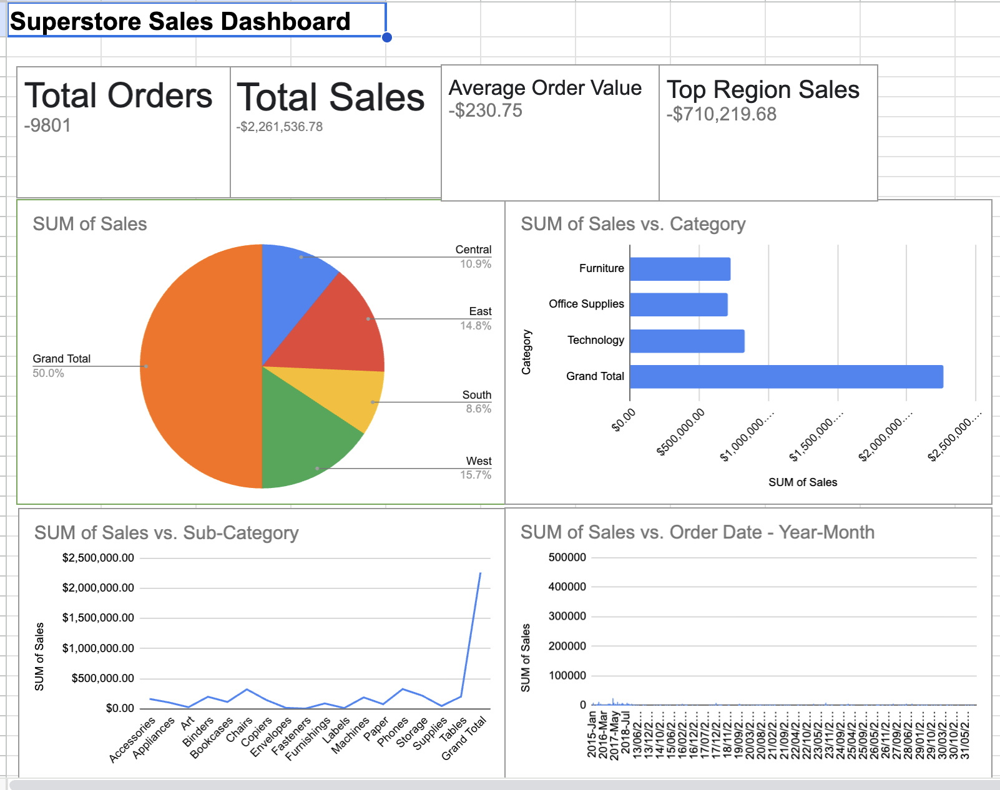

# 📊 Superstore Sales Dashboard (Google Sheets)

## 📊 Dashboard Preview

Here’s a snapshot of the dashboard:

You can also download and explore the interactive dashboard here:  
[📂 Superstore Sales Dashboard (Excel)](Superstore_Sales_Dashboard.xlsx)

## 📌 Overview
This project demonstrates how to build a **Sales Dashboard** in **Google Sheets** using the *Superstore Sales Dataset* from Kaggle.  
The goal is to practice **data analysis, pivot tables, and visualization** while showcasing insights that can help a business understand performance by region, category, and over time.  

---

## 🗂 Dataset
- **Source:** [Kaggle - Superstore Sales Dataset](https://www.kaggle.com/)  
- **Data Columns Used:**  
  - Order Date  
  - Region  
  - Category  
  - Sub-Category  
  - Sales  

---

## ⚡ Steps Taken
1. Imported dataset (`.csv`) into **Google Sheets**.  
2. Built **Pivot Tables** for:  
   - Sales by Region  
   - Sales by Category  
   - Sales by Sub-Category  
   - Monthly Sales Trend  
3. Created **visualizations** (Pie chart, Bar chart, Line chart).  
4. Added **KPI Cards**:  
   - Total Sales  
   - Total Orders  
   - Average Order Value  
   - Top Region Sales  
5. Designed a **Dashboard sheet** with charts, KPIs, and insights.  

---

## 📈 Dashboard Preview
  
*(Replace with your actual screenshot once uploaded)*  

---

## 🔑 Key Insights
- The **West region** leads sales with ~$710K.  
- **Technology** is the top-performing category.  
- **Phones** drive the highest sub-category sales (~$2M).  
- Sales show **seasonal peaks in Q4**, indicating holiday-driven demand.  

---

## 🛠 Tools Used
- **Google Sheets** → Data analysis, pivot tables, and charts  
- **Kaggle Dataset** → Source data  
- **GitHub** → Project documentation and sharing  

---

## 🚀 Next Steps
- Rebuild the same dashboard in **SQL** for querying practice.  
- Create an **interactive version** using **Tableau** or **Power BI**.  
- Expand analysis to include profitability if profit data is available.  

---

💡 *This project is part of my data analytics portfolio. Feedback and suggestions are always welcome!*  
